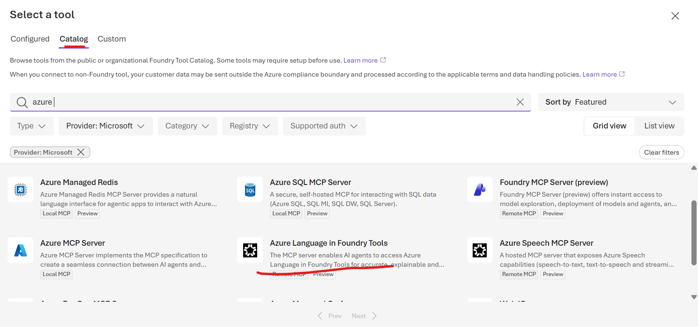

# Azure Language: Text Analysis

**Remember: Language understands text; OCR reads images; Translator translates.**

- **Azure Language in Foundry Tools** extracts information from text through ready-to-use NLP APIs and SDKs for applications, and supported tools for agents.
- Choose the capability that matches the task:

| Need | Capability |
|---|---|
| Determine which language text is written in | Language detection |
| Detect people, locations, time periods, organizations, and other entities | Prebuilt named entity recognition (NER) |
| Extract domain-specific entity categories | Custom NER |
| Identify and redact personal details in text | Personally identifiable information (PII) detection |


*Diagram: Microsoft Learn.*

**Example:** A support app detects a message's language, extracts relevant entities, and redacts detected PII before permitted downstream processing.

## Agent integration: Azure Language MCP server

**REST/SDK -> your code chooses the capability; MCP -> the agent selects an exposed language tool.**

- The **Azure Language Model Context Protocol (MCP) server (preview)** exposes capabilities such as language detection, NER, and PII redaction to MCP-compatible agents.
- Configure the connection, authentication, and permissions; the agent can then choose and call an appropriate tool based on the user's request, without custom per-capability integration code.
- In the Foundry tool catalog, select **Azure Language in Foundry Tools**.

**Remote MCP endpoint (preview):**

```text
https://{foundry-resource-name}.cognitiveservices.azure.com/language/mcp?api-version=2025-11-15-preview
```

- Replace `{foundry-resource-name}` with your resource name at runtime; keep real endpoints out of repository content.
- This is the **Language MCP endpoint**, not the Foundry project endpoint or the resource root passed to `TextAnalyticsClient`.



[Microsoft Learn: Azure Language MCP server](https://learn.microsoft.com/azure/ai-services/language-service/concepts/foundry-tools-agents#azure-language-mcp-server-preview)

### MCP architecture

**Host runs the agent; client connects; server exposes capabilities.**

MCP is an open protocol for connecting AI applications to external tools, data sources, and services.

| Component | Responsibility |
|---|---|
| Host | Application that runs the agent and manages MCP clients, such as Microsoft Foundry or a custom app |
| Client | Component inside the host that manages a dedicated connection to an MCP server and handles protocol communication |
| Server | Local or remote program that exposes supported tools, resources, and prompts |

- A host can connect to multiple servers through separate clients.
- **Tools are called; resources are read; prompts are retrieved.** Not every server exposes all three.

[MCP documentation: Architecture](https://modelcontextprotocol.io/docs/learn/architecture)

### Dynamic tool discovery

**Discover at runtime -> choose a tool -> call it.**

- Through its MCP client, the host queries the server's tool catalog (`tools/list`): tool names, descriptions, and input schemas.
- The host makes available tools known to the agent, which selects an appropriate tool for the user's request; the client invokes it with `tools/call`.
- No hardcoded knowledge of each tool is required, but connection setup, authentication, permissions, and host tool policies still apply.

### How the agent selects tools

**Prompt -> task -> tool match -> call -> results -> response.**

1. The user sends a prompt.
2. The agent identifies the required task or tasks.
3. It matches those tasks to available MCP tool descriptions and input schemas.
4. The host's MCP client calls the selected tool on the server with the relevant input text, subject to tool policies and any required approval.
5. The server invokes the appropriate Azure Language capability and returns its results.
6. The agent uses the results to compose a natural language response.

### Invoke a configured Foundry agent

**`agent_reference` selects the agent; `output_text` exposes its text response.**

Prerequisites: an authenticated `AIProjectClient` for the **project endpoint**, an existing agent named `Text-Analysis-Agent` with the required tools configured, and a defined `user_prompt`.

```python
openai_client = project_client.get_openai_client()

response = openai_client.responses.create(
    input=[{"role": "user", "content": user_prompt}],
    extra_body={
        "agent_reference": {
            "name": "Text-Analysis-Agent",
            "type": "agent_reference",
        }
    },
)

print(response.output_text)
```

- This invokes the existing agent; it does **not** create the agent or configure its MCP connection.
- `output_text` contains text, not the complete tool-call trace; inspect `response.output` for output items, including tool calls.

[Microsoft Learn: Generate agent responses](https://learn.microsoft.com/azure/foundry/agents/concepts/runtime-components#generate-responses)

## Important: Mixed-language detection

**Mixed text -> one predominant language, potentially lower confidence; not a list of every language.**

- The document result reflects the language with the largest representation. Mixed-language content can reduce `confidence_score` (0-1), indicating ambiguity, not negative sentiment.
- Example: `I know a cool AI developer. He has a certain je ne sais quoi!` is mostly English with a French phrase; expect English as predominant, but do not assume a fixed score.
- A document-level English result does **not** mean every sentence is English. For finer-grained analysis, submit meaningful segments separately; very short segments can also be ambiguous.

[Microsoft Learn: Mixed-language content](https://learn.microsoft.com/azure/ai-services/language-service/language-detection/how-to/call-api#mixed-language-content)

## Important: Unknown language

**Unidentifiable text -> name `(unknown)`, ISO code `(unknown)`, confidence `0`.**

- This can happen when the analyzer cannot interpret the text, for example after incorrect character decoding when converting input to a string.
- Contrast: mixed-language text can return a predominant language with lower confidence; `(unknown)` means no language was identified, not proof of an encoding problem.

[Microsoft Learn: Detect language](https://learn.microsoft.com/training/modules/analyze-text-ai-language/3-detect-language)

## Named entity recognition (NER)

**NER identifies mentioned entities and labels them; PII detection identifies sensitive details for redaction.**

- Examples: `Person`, `Location`, `DateTime`, `Organization`, `Address`, `Email`, `URL`.
- Labels depend on API version: older responses use categories/subcategories; newer GA APIs (2024-11-01 onward) use `type` instead of `subcategory`.

[Microsoft Learn: NER entity categories and types](https://learn.microsoft.com/azure/ai-services/language-service/named-entity-recognition/concepts/named-entity-categories)

### NER example: People vs. roles

**`Satya Nadella` -> Person; `CEO` -> PersonType (a role, not a person's name).**

```python
documents = [
    "Microsoft was founded on April 4, 1975 by Bill Gates and Paul Allen in Albuquerque, New Mexico.",
    "Satya Nadella became CEO of Microsoft on February 4, 2014.",
]
```

Illustrative category-based results:

| Document | Entity text | Category |
|---|---|---|
| 0 | Microsoft | Organization |
| 0 | April 4, 1975 | DateTime |
| 0 | Bill Gates; Paul Allen | Person (two entities) |
| 0 | Albuquerque; New Mexico | Location (two entities) |
| 1 | Satya Nadella | Person |
| 1 | CEO | PersonType |
| 1 | Microsoft | Organization |
| 1 | February 4, 2014. | DateTime |

Exact spans (including punctuation) and labels can vary by model/API version.

**Caveats:** Detection is not guaranteed to find every entity or sensitive value. Check feature-specific language support, limits, and lifecycle status; protect inputs and logs as well as outputs.

[Microsoft Learn: Azure Language overview](https://learn.microsoft.com/azure/ai-services/language-service/overview) | [Learning path](https://learn.microsoft.com/training/paths/develop-language-solutions-azure-ai/)
