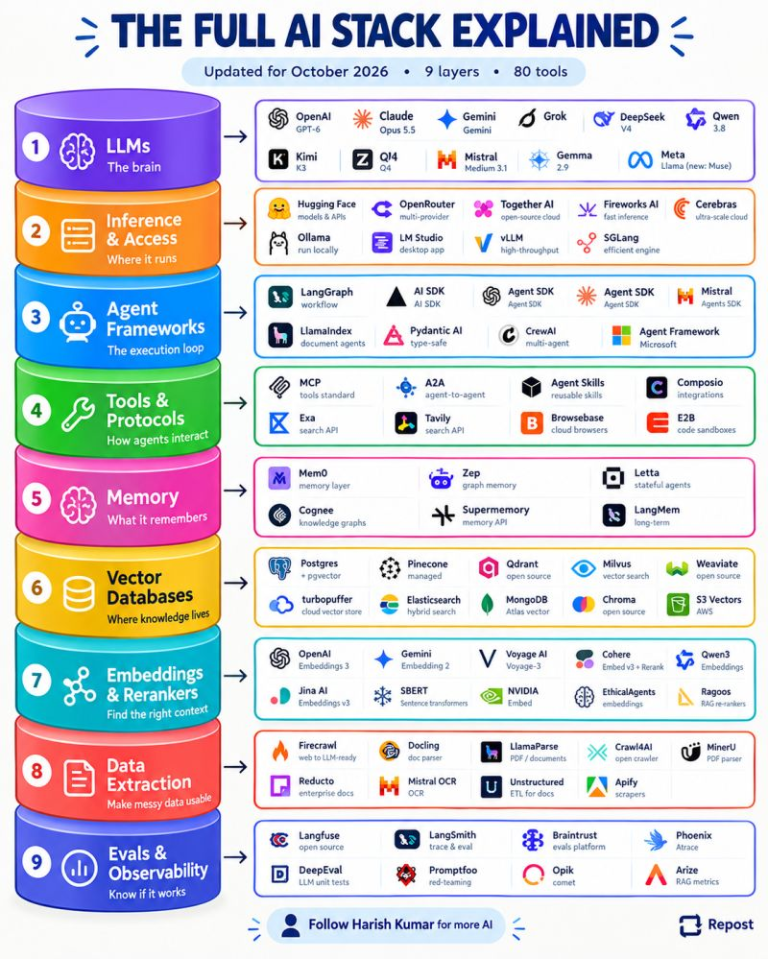

# AI-103: Microsoft Certified: Azure AI Apps and Agents Developer Associate

[Official certification](https://learn.microsoft.com/en-us/credentials/certifications/azure-ai-apps-and-agents-developer-associate/?practice-assessment-type=certification)
 

**Pass exam (score ≥700) + build production-grade AI agent skills**

---
 ## Why I Chose This Certification

I've been using Microsoft Foundry (formerly Azure AI Foundry),the Azure Cosmos DB toolkit, and Foundry IQ (Azure AI Search) to build agents. I chose this certification to broaden my understanding of Azure AI services, discover features I haven't explored, and make better architectural decisions when building code-first AI solutions.

## My Study Approach

I'll work through the official Microsoft Learn content to solidify my understanding, build small projects where needed, and test my knowledge with the practice questions in this repo. I'll keep the content concise and relevant.

## Course Structure

The course has **4 learning paths** with **34 modules total**:

| Official Learning Path | My Learnings | Practice Questions | Weight | My Priority (1–5) |
|------------------------|--------------|--------------------|--------|-------------------|
| [1. Develop generative AI apps in Azure](https://learn.microsoft.com/en-us/training/paths/develop-generative-ai-apps/) | [Notes and projects](./1.%20Develop%20generative%20AI%20apps%20in%20Azure/) | [Question bank](./1.%20Develop%20generative%20AI%20apps%20in%20Azure/questions/) | 30–35% | **5/5 — Core focus** |
| [2. Develop AI agents on Azure](https://learn.microsoft.com/en-us/training/paths/develop-ai-agents-azure/) | [Notes and projects](./2.%20Develop%20AI%20agents%20on%20Azure/) | [Question bank](https://github.com/psingla/Microsoft-Azure-AI-103-Certification/tree/main/2.%20Develop%20AI%20agents%20on%20Azure/questions) | 30–35% | **5/5 — Core focus** |
| [3. Develop natural language solutions in Azure](https://learn.microsoft.com/en-us/training/paths/develop-language-solutions-azure-ai/) | [Notes and projects](https://github.com/psingla/Microsoft-Azure-AI-103-Certification/tree/main/3.%20Develop%20natural%20language%20solutions%20in%20Azure) | [Question bank](https://github.com/psingla/Microsoft-Azure-AI-103-Certification/tree/main/3.%20Develop%20natural%20language%20solutions%20in%20Azure/questions) | 10–15% | **3/5 — Supporting knowledge** |
| [4. Extract insights from visual data on Azure](https://learn.microsoft.com/en-us/training/paths/insight-visual-data/) | [Notes and projects](https://github.com/psingla/Microsoft-Azure-AI-103-Certification/tree/main/4.%20Extract%20insights%20from%20visual%20data%20on%20Azure) | [Question bank](https://github.com/psingla/Microsoft-Azure-AI-103-Certification/tree/main/4.%20Extract%20insights%20from%20visual%20data%20on%20Azure/questions) | 20–30% | **3/5 — Supporting knowledge** |

*My Priority reflects my current learning focus, not exam weight: 1 = lowest, 5 = highest. Ratings can change as I progress.*

My notes, projects, and topic-specific question banks cover all four learning paths, with paths 1 and 2 remaining my core focus. This is a personal study choice, not a claim that the supporting paths are unimportant for the exam.

### Full-Length Practice Test Papers

[Full-length case-based question papers](./test-papers/) cover topics across the certification.

- [60-question full practice test](./test-papers/ai-103-full-practice-test.html): 45 standalone scenarios, 8 direct questions, and one final case study with 7 questions. Includes hidden answers and explanations.
- [60-question focused practice paper](./test-papers/ai-103-ocr-search-evaluation-practice-test.html): OCR, evaluation, Azure AI Search, built-in skills and agent tools/function calling, and OpenAI endpoints. Mostly scenarios, with one final 7-question case study and explained answers.

**All practice questions in this repository are AI-generated**, not official Microsoft exam questions. They may contain errors; verify answers against current Microsoft Learn documentation.

## The AI Stack: Beyond This Certification

These concepts apply across AI platforms, not just Azure or AI-103.

*Infographic credit: GenAI.works.*

### The Full AI Stack

*Infographic credit: Harish Kumar, as shown in the supplied image. This is a third-party overview, not an official Microsoft architecture or certification guide; verify tool and model details against current documentation.*

---

*Last updated: 2026-10-06*

