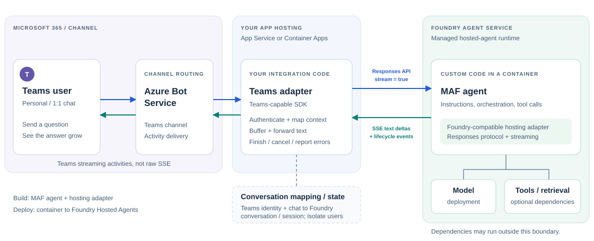

# Key Learnings: Generative AI and Agents

**Start with a model call. Add knowledge when it lacks information, tools when it needs access or actions, and orchestration when the work needs coordination.**

## 1. A generative AI application starts with a model call

An application sends input to a model through an API and receives a generated response. The **endpoint** determines where the request goes; the **SDK** provides the client used to call that API.

| What the application needs | Endpoint and client |
| --- | --- |
| Direct supported model calls, without Foundry project features | Azure OpenAI endpoint with the OpenAI SDK. |
| Foundry project features such as agents, connections, and evaluations | Project endpoint with the Foundry SDK (`AIProjectClient`). |
| Model calls through a Foundry project | Use `project.get_openai_client()` to obtain an OpenAI-compatible client. |

The SDKs complement each other: **Foundry SDK accesses project services; OpenAI SDK accesses supported model APIs.** The bare project URL is not an OpenAI `base_url`; let `get_openai_client()` configure that route.

For response generation, prefer **Responses** in new supported workflows; use **Chat Completions** where compatibility requires it. Check **model + endpoint + region + API support** rather than assuming every catalog model supports the same APIs.

Details: [Endpoints, SDKs, and Responses](../1.%20Develop%20generative%20AI%20apps%20in%20Azure/notes/foundry-endpoints-mental-note.md).

## 2. A model call needs relevant knowledge to answer reliably

Connecting to a model does not automatically give it current or private information. **Retrieval-augmented generation (RAG)** addresses this by finding relevant external content and including it in the model's input:

**Retrieve evidence -> Augment the question with that evidence -> Generate an answer.**

Azure AI Search can provide the retrieval layer. Prepare documents by ingesting and chunking them, then index the text and metadata; add embeddings for vector retrieval. At query time, choose how to find relevant chunks:

| Retrieval choice | How it contributes |
| --- | --- |
| **Keyword** | Matches analyzed terms; useful for names, codes, and specific wording. |
| **Vector** | Uses embeddings to find similar meaning, even when wording differs. |
| **Hybrid** | Combines keyword and vector rankings using reciprocal rank fusion (RRF). |
| **Semantic ranker** | Reranks retrieved candidates; does not replace retrieval. |

Query embeddings must be compatible with indexed embeddings. Hybrid + semantic ranking is a strong starting point, but evaluate relevance, latency, and cost on your questions.

**Foundry IQ** builds on Azure AI Search's agentic retrieval capabilities; it is not simply a renamed Azure AI Search.

**Remember: search supplies evidence; the model generates the answer. Grounding reduces errors but does not guarantee truth.**

Details: [RAG process](../2.%20Develop%20AI%20agents%20on%20Azure/notes/rag-process.md) | [Search for RAG](../1.%20Develop%20generative%20AI%20apps%20in%20Azure/notes/azure-ai-search-rag-retrieval.md) | [Foundry IQ FAQ](https://learn.microsoft.com/en-us/azure/foundry/agents/concepts/foundry-iq-faq).

## 3. Tools extend the application beyond answering from supplied text

Retrieval provides knowledge, but an application may also need live API results or actions such as creating a record. **Tools expose these external capabilities.** Retrieval itself can be exposed as a tool, so RAG and tool use are complementary, not competing approaches.

- **Function tools:** expose application functions and business logic.
- **MCP:** connects agents to tools exposed by MCP servers.
- **Work IQ:** provides Microsoft 365 workplace context through CLI/MCP, including emails, meetings, documents, and Teams messages. Access requires tenant-admin consent; the source note identifies it as public preview.

The model can propose which tool to call, but application or service code executes it under configured controls.

**Model chooses; instructions guide; tool settings constrain; authorization enforces access.**

Reading data and changing external systems have different risks. Validate tool results and require appropriate permissions or approvals for actions. Prompt instructions alone are not an authorization boundary.

Details: [Why tools matter](../1.%20Develop%20generative%20AI%20apps%20in%20Azure/notes/why-tools-matter.md) | [Work IQ](../2.%20Develop%20AI%20agents%20on%20Azure/notes/work-iq.md).

## 4. Agents coordinate model calls, tools, and conversation context

Once the application must choose tools, use their results, and continue toward a task, it needs agent behavior rather than an isolated model call. **Microsoft Agent Framework (MAF)** provides reusable agent orchestration, tool integration, and conversation-state abstractions.

This adds a layer above the clients introduced earlier: **MAF coordinates behavior; SDKs access services; endpoints receive requests.** MAF does not replace every Foundry SDK capability or remove the endpoint choice.

To continue across turns, the agent needs the right context:

| Component | Responsibility |
| --- | --- |
| **Session** | Maintains conversation state across turns. |
| **Context provider** | Supplies relevant memory or information dynamically. |
| **Middleware** | Intercepts execution for checks, logging, or modification; it is not conversation storage. |

Service-side history reduces the need to resend messages, but the application must retain the correct session or response reference. Unrelated Responses requests do not automatically share context; link turns or use a supported conversation mechanism.

**Stored history is not automatic continuity or user isolation.** Preserve references across restarts, configure durable storage where needed, and enforce session ownership. In-memory state alone does not survive restarts.

Details: [Microsoft Agent Framework](../2.%20Develop%20AI%20agents%20on%20Azure/notes/microsoft-agent-framework.md).

## 5. Workflows organize tasks that need explicit control

An agent handles task-oriented interaction; a **workflow** defines how steps, agents, and application logic fit together. Use one when work needs sequencing, branching, parallel execution, or human input. A workflow does not require multiple agents.

**Executors work; edges route; events report; checkpoints resume.**

- **Executors** run agents or custom logic; **edges** determine where results go.
- **Fan-out** distributes work; **fan-in** collects branch results.
- **Events** expose progress, results, failures, or requests for input.
- **Checkpoints** preserve workflow progress. Unlike a session's conversation history, they allow workflow execution to resume; durable recovery requires appropriate storage.

Choose the orchestration pattern from the required control flow:

| Requirement | Pattern |
| --- | --- |
| Fixed steps that build on earlier output | **Sequential** |
| Independent work or perspectives | **Concurrent** |
| Dynamic expert routing or escalation | **Handoff** |
| Shared discussion with speaker selection | **Group chat** |
| An evolving plan with adaptive delegation | **Magentic** |

More agents add coordination, latency, and cost; they do not guarantee better answers. Collecting concurrent responses also does not automatically produce consensus.

Concurrency can overlap independent network waits. **Async does not inherently speed up one response**, and sequential `await` calls remain sequential. Bound concurrency to respect quota.

Match examples to installed SDK versions because API names and output shapes change. For new workflows, use MAF: **Foundry visual workflows retire December 1, 2026**, not MAF workflow orchestration.

Details: [MAF workflows](../2.%20Develop%20AI%20agents%20on%20Azure/notes/microsoft-agent-framework.md) | [Foundry workflows](../2.%20Develop%20AI%20agents%20on%20Azure/notes/foundry-workflows.md) | [Official retirement notice](https://learn.microsoft.com/en-us/azure/foundry/agents/concepts/workflow).

## 6. Collaboration across agent systems needs a communication protocol

Workflow orchestration determines what should happen next. When a participating agent belongs to another framework or vendor, **A2A** standardizes how agents communicate and delegate work; it does not replace the workflow's control logic.

Discovery follows: **find an Agent Card -> select a suitable skill -> satisfy authentication requirements -> send an A2A request.**

- **Agent Card:** describes the agent, its service endpoint, skills, protocol features, and authentication requirements.
- **A2A skill:** advertises a capability, not its implementation.
- **MCP connects agents to tools; A2A connects agents to agents.** Not every multi-agent workflow needs A2A.

Discovery is not trust: finding a card does not grant access. Enforce authorization and never embed credentials in cards.

Details: [A2A protocol](../2.%20Develop%20AI%20agents%20on%20Azure/notes/agent-to-agent-protocol.md).

## 7. Publishing makes the agent accessible, with a new access boundary

After the agent's model access, tools, state, and orchestration work together, publishing exposes it to users. In the **legacy Agent Application model**, publishing provides a **stable invocation URL, separate identity, and independent access control**.

That identity change affects the dependencies described earlier: the published identity needs its own permissions to search and other downstream systems. Project permissions do not transfer automatically.

Conversation behavior must also be checked at this boundary. The documented legacy Agent Application Responses endpoint is stateless; do not assume conversation APIs or full end-user isolation. Keep users' histories separate in the client.

For supported Teams/Copilot integrations, start with Foundry portal publishing. Use **Microsoft 365 Agents Toolkit** when a custom proxy needs SSO customization, middleware, or deployment pipelines; the proxy is an additional application to maintain.

**Publishing does not remove the need to validate answers, authorize actions, isolate state, and monitor workflow behavior.**

Details: [Agent publishing](../2.%20Develop%20AI%20agents%20on%20Azure/notes/agent-publishing.md).

## 8. Architecture: bringing the concepts together

**Teams is the interface; MAF defines agent behavior; Foundry Agent Service hosts the agent.**

This example uses a **custom Teams adapter**: requests travel left to right; streamed answers return right to left. Blue arrows show requests, green arrows show responses, and dashed lines show conversation-state mapping.

- The agent uses the model, tools, and retrieval described above; the adapter maps each authorized Teams conversation to the correct agent session.
- **Two streaming legs:** Foundry streams to the adapter; the adapter separately sends Teams streaming messages. Backend streaming alone does not guarantee progressive text in Teams.
- **Simpler alternative:** publish directly through Foundry's managed Teams integration when a custom adapter is unnecessary; verify the end-to-end streaming experience.

[Open the full architecture page, implementation constraints, and official references](../architecture/teams-foundry-agent-architecture.html).

### The whole idea to remember

**The model generates. RAG grounds. Tools extend access. Agents coordinate behavior. Sessions preserve context. Workflows control progress. A2A enables cross-agent communication. Publishing exposes the result securely when access controls are configured correctly.**

Use only the layers the task needs; this is a progression of capabilities, not a mandatory runtime pipeline.

*Based on the nine study notes above. Foundry IQ terminology and workflow retirement checked against Microsoft Learn on 2026-10-07. Preview, legacy, and SDK details can change. These notes focus on generative AI and agents, not the full exam; retain language and visual-data revision.*
